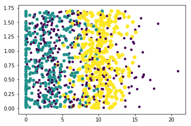

# 使用K近邻算法改进约会网站的配对效果-KNN算法学习
0.说在前面 1.反转字符串 2.作者的话

# 0.说在前面
跟着机器学习实战训练营学习KNN算法，这是其中的例子。

# 1.使用K近邻算法改进约会网站的配对效果
问题
海伦通过约会网站寻找适合自己的约会对象，她希望通过一种算法将约会网站推荐的对象归入正确的类别。。


算法：K近邻算法
思想：存在一个样本数据集合，也称作训练样本集，并且样本集中的每个数据都存在标签，即我们知道样本集中的每一个数据与所属分类的对应关系。如数没有标签的新数据后，将新数据的每个特征与样本集中数据进行比较，然后算法提取样本集中特征最相似的数据的分类标签。一般来说，我们只选择样本数据集中钱K个最相似的数据，这就是K近邻算法中k的出处。最后，选择K个最相似数据中出现次数最多的分类，作为新数据的分类。

1.导入Numpy


```python
from numpy import *
import operator

def creatDataSet():
    group = array([[1.0,1.1],[1.0,1.0],[0,0],[0,0.1]])
    labels = ['A','A','B','B']
    return group,labels

group,labels = creatDataSet()
group

```


    array([[1. , 1.1],
           [1. , 1. ],
           [0. , 0. ],
           [0. , 0.1]])


2、定义K近邻算法函数


```python
def classify0(inX, dataSet, labels, k):
    dataSetSize = dataSet.shape[0] 
    diffMat = tile(inX, (dataSetSize,1)) - dataSet 
    sqDiffMat = diffMat**2  
    sqDistances = sqDiffMat.sum(axis=1)
    distances = sqDistances**0.5 
    sortedDistIndicies = distances.argsort()
    classCount={}          
    for i in range(k):
        voteIlabel = labels[sortedDistIndicies[i]]
        classCount[voteIlabel] = classCount.get(voteIlabel,0) + 1
    sortedClassCount = sorted(classCount.items(), key=operator.itemgetter(1), reverse=True)
    return sortedClassCount[0][0]
```

3、将文本记录转换为Numpy的解析程序


```python
def file2matrix(filename):
    fr = open(filename)
    arrayOLines = fr.readlines()
    numberOfLines = len(arrayOLines)
    returnMat = zeros((numberOfLines,3))
    classLabelVector = []
    index = 0
    for line in arrayOLines:
        line = line.strip()
        listFromLine = line.split('\t')
        returnMat[index,:] = listFromLine[0:3]
        classLabelVector.append(int(listFromLine[-1]))
        index +=1
    return returnMat,classLabelVector
```


```python
#导入数据
datingDataMat,datingLabels = file2matrix('datingTestSet2.txt')
datingLabels[0:20]
datingDataMat
```


    array([[4.0920000e+04, 8.3269760e+00, 9.5395200e-01],
           [1.4488000e+04, 7.1534690e+00, 1.6739040e+00],
           [2.6052000e+04, 1.4418710e+00, 8.0512400e-01],
           ...,
           [2.6575000e+04, 1.0650102e+01, 8.6662700e-01],
           [4.8111000e+04, 9.1345280e+00, 7.2804500e-01],
           [4.3757000e+04, 7.8826010e+00, 1.3324460e+00]])


```python
#绘制散点图
import matplotlib
import matplotlib.pyplot as plt
fig = plt.figure()
ax = fig.add_subplot(111)
ax.scatter(datingDataMat[:,1],datingDataMat[:,2])
plt.show()

```


    <Figure size 640x480 with 1 Axes>


```python
#个性化标记散点图上的点
fig = plt.figure()
ax = fig.add_subplot(111)
ax.scatter(datingDataMat[:,1], datingDataMat[:,2], 15.0*array(datingLabels),15.0*array(datingLabels))
plt.show()

```





4、归一化特征值，消除单位影响


```python

def autoNorm(dataSet):
    minVals = dataSet.min(0)
    maxVals = dataSet.max(0)
    ranges = maxVals - minVals
    normDataSet = zeros(shape(dataSet))
    m = dataSet.shape[0]
    normDataSet= dataSet - tile(minVals,(m,1))
    normDataSet = normDataSet/tile(ranges,(m,1))
    return normDataSet,ranges,minVals
```


```python
normMat,ranges,minVals = autoNorm(datingDataMat)
normMat
```


    array([[0.44832535, 0.39805139, 0.56233353],
           [0.15873259, 0.34195467, 0.98724416],
           [0.28542943, 0.06892523, 0.47449629],
           ...,
           [0.29115949, 0.50910294, 0.51079493],
           [0.52711097, 0.43665451, 0.4290048 ],
           [0.47940793, 0.3768091 , 0.78571804]])


```python
ranges
```


    array([9.1273000e+04, 2.0919349e+01, 1.6943610e+00])


```python
minVals
```


    array([0.      , 0.      , 0.001156])


5、测试分类器的效果


```python
def datingClassTest():
    hoRatio = 0.10
    datingDataMat,datingLabels = file2matrix('datingTestSet2.txt')
    normMat, ranges, minVals = autoNorm(datingDataMat)
    m = normMat.shape[0]
    numTestVecs = int(m*hoRatio)
    errorCount = 0.0
    for i in range(numTestVecs):
        classifierResult = classify0(normMat[i,:],normMat[numTestVecs:m,:],datingLabels[numTestVecs:m],3)
        print('the classifier came back with:%d,the real answer is :%d'%(classifierResult,datingLabels[i]))
        if (classifierResult != datingLabels[i]):errorCount +=1.0
        print('the totel error rate is %f'%(errorCount/float(numTestVecs)))
```


```python
datingClassTest()
```

    the classifier came back with:3,the real answer is :3
    the totel error rate is 0.000000
    the classifier came back with:2,the real answer is :2
    the totel error rate is 0.000000
    the classifier came back with:1,the real answer is :1
    the totel error rate is 0.000000
    the classifier came back with:1,the real answer is :1
    the totel error rate is 0.000000
    the classifier came back with:1,the real answer is :1
    the totel error rate is 0.000000
    the classifier came back with:1,the real answer is :1
    the totel error rate is 0.000000
    the classifier came back with:3,the real answer is :3
    the totel error rate is 0.000000
    the classifier came back with:3,the real answer is :3
    the totel error rate is 0.000000
    the classifier came back with:1,the real answer is :1
    the totel error rate is 0.000000
    the classifier came back with:3,the real answer is :3
    the totel error rate is 0.000000
    the classifier came back with:1,the real answer is :1
    the totel error rate is 0.000000
    the classifier came back with:1,the real answer is :1
    the totel error rate is 0.000000
    the classifier came back with:2,the real answer is :2
    the totel error rate is 0.000000
    the classifier came back with:1,the real answer is :1
    the totel error rate is 0.000000
    the classifier came back with:1,the real answer is :1
    the totel error rate is 0.000000
    the classifier came back with:1,the real answer is :1
    the totel error rate is 0.000000
    the classifier came back with:1,the real answer is :1
    the totel error rate is 0.000000
    the classifier came back with:1,the real answer is :1
    the totel error rate is 0.000000
    the classifier came back with:2,the real answer is :2
    the totel error rate is 0.000000
    the classifier came back with:3,the real answer is :3
    the totel error rate is 0.000000
    the classifier came back with:2,the real answer is :2
    the totel error rate is 0.000000
    the classifier came back with:1,the real answer is :1
    the totel error rate is 0.000000
    the classifier came back with:3,the real answer is :2
    the totel error rate is 0.010000
    the classifier came back with:3,the real answer is :3
    the totel error rate is 0.010000
    the classifier came back with:2,the real answer is :2
    the totel error rate is 0.010000
    the classifier came back with:3,the real answer is :3
    the totel error rate is 0.010000
    the classifier came back with:2,the real answer is :2
    the totel error rate is 0.010000
    the classifier came back with:3,the real answer is :3
    the totel error rate is 0.010000
    the classifier came back with:2,the real answer is :2
    the totel error rate is 0.010000
    the classifier came back with:1,the real answer is :1
    the totel error rate is 0.010000
    the classifier came back with:3,the real answer is :3
    the totel error rate is 0.010000
    the classifier came back with:1,the real answer is :1
    the totel error rate is 0.010000
    the classifier came back with:3,the real answer is :3
    the totel error rate is 0.010000
    the classifier came back with:1,the real answer is :1
    the totel error rate is 0.010000
    the classifier came back with:2,the real answer is :2
    the totel error rate is 0.010000
    the classifier came back with:1,the real answer is :1
    the totel error rate is 0.010000
    the classifier came back with:1,the real answer is :1
    the totel error rate is 0.010000
    the classifier came back with:2,the real answer is :2
    the totel error rate is 0.010000
    the classifier came back with:3,the real answer is :3
    the totel error rate is 0.010000
    the classifier came back with:3,the real answer is :3
    the totel error rate is 0.010000
    the classifier came back with:1,the real answer is :1
    the totel error rate is 0.010000
    the classifier came back with:2,the real answer is :2
    the totel error rate is 0.010000
    the classifier came back with:3,the real answer is :3
    the totel error rate is 0.010000
    the classifier came back with:3,the real answer is :3
    the totel error rate is 0.010000
    the classifier came back with:3,the real answer is :3
    the totel error rate is 0.010000
    the classifier came back with:1,the real answer is :1
    the totel error rate is 0.010000
    the classifier came back with:1,the real answer is :1
    the totel error rate is 0.010000
    the classifier came back with:1,the real answer is :1
    the totel error rate is 0.010000
    the classifier came back with:1,the real answer is :1
    the totel error rate is 0.010000
    the classifier came back with:2,the real answer is :2
    the totel error rate is 0.010000
    the classifier came back with:2,the real answer is :2
    the totel error rate is 0.010000
    the classifier came back with:1,the real answer is :1
    the totel error rate is 0.010000
    the classifier came back with:3,the real answer is :3
    the totel error rate is 0.010000
    the classifier came back with:2,the real answer is :2
    the totel error rate is 0.010000
    the classifier came back with:2,the real answer is :2
    the totel error rate is 0.010000
    the classifier came back with:2,the real answer is :2
    the totel error rate is 0.010000
    the classifier came back with:2,the real answer is :2
    the totel error rate is 0.010000
    the classifier came back with:3,the real answer is :3
    the totel error rate is 0.010000
    the classifier came back with:1,the real answer is :1
    the totel error rate is 0.010000
    the classifier came back with:2,the real answer is :2
    the totel error rate is 0.010000
    the classifier came back with:1,the real answer is :1
    the totel error rate is 0.010000
    the classifier came back with:2,the real answer is :2
    the totel error rate is 0.010000
    the classifier came back with:2,the real answer is :2
    the totel error rate is 0.010000
    the classifier came back with:2,the real answer is :2
    the totel error rate is 0.010000
    the classifier came back with:2,the real answer is :2
    the totel error rate is 0.010000
    the classifier came back with:2,the real answer is :2
    the totel error rate is 0.010000
    the classifier came back with:3,the real answer is :3
    the totel error rate is 0.010000
    the classifier came back with:2,the real answer is :2
    the totel error rate is 0.010000
    the classifier came back with:3,the real answer is :3
    the totel error rate is 0.010000
    the classifier came back with:1,the real answer is :1
    the totel error rate is 0.010000
    the classifier came back with:2,the real answer is :2
    the totel error rate is 0.010000
    the classifier came back with:3,the real answer is :3
    the totel error rate is 0.010000
    the classifier came back with:2,the real answer is :2
    the totel error rate is 0.010000
    the classifier came back with:2,the real answer is :2
    the totel error rate is 0.010000
    the classifier came back with:3,the real answer is :1
    the totel error rate is 0.020000
    the classifier came back with:3,the real answer is :3
    the totel error rate is 0.020000
    the classifier came back with:1,the real answer is :1
    the totel error rate is 0.020000
    the classifier came back with:1,the real answer is :1
    the totel error rate is 0.020000
    the classifier came back with:3,the real answer is :3
    the totel error rate is 0.020000
    the classifier came back with:3,the real answer is :3
    the totel error rate is 0.020000
    the classifier came back with:1,the real answer is :1
    the totel error rate is 0.020000
    the classifier came back with:2,the real answer is :2
    the totel error rate is 0.020000
    the classifier came back with:3,the real answer is :3
    the totel error rate is 0.020000
    the classifier came back with:3,the real answer is :1
    the totel error rate is 0.030000
    the classifier came back with:3,the real answer is :3
    the totel error rate is 0.030000
    the classifier came back with:1,the real answer is :1
    the totel error rate is 0.030000
    the classifier came back with:2,the real answer is :2
    the totel error rate is 0.030000
    the classifier came back with:2,the real answer is :2
    the totel error rate is 0.030000
    the classifier came back with:1,the real answer is :1
    the totel error rate is 0.030000
    the classifier came back with:1,the real answer is :1
    the totel error rate is 0.030000
    the classifier came back with:3,the real answer is :3
    the totel error rate is 0.030000
    the classifier came back with:2,the real answer is :3
    the totel error rate is 0.040000
    the classifier came back with:1,the real answer is :1
    the totel error rate is 0.040000
    the classifier came back with:2,the real answer is :2
    the totel error rate is 0.040000
    the classifier came back with:1,the real answer is :1
    the totel error rate is 0.040000
    the classifier came back with:3,the real answer is :3
    the totel error rate is 0.040000
    the classifier came back with:3,the real answer is :3
    the totel error rate is 0.040000
    the classifier came back with:2,the real answer is :2
    the totel error rate is 0.040000
    the classifier came back with:1,the real answer is :1
    the totel error rate is 0.040000
    the classifier came back with:3,the real answer is :1
    the totel error rate is 0.050000
    

6、用分类器进行分类


```python
def classifyPerson():
    resultList = ['not at all','in small doses','in large doses']
    percentTats = float(input("percentage of time spent playing video games?"))
    ffMiles = float(input("frequent flier miles earned per year?"))
    iceCream = float(input("liters of ice cream consumed per year?"))
    datingDataMat,datingLabels = file2matrix('datingTestSet2.txt')
    normMat,ranges,minVals = autoNorm(datingDataMat)
    inArr = array([ffMiles,percentTats,iceCream])
    classifierResult = int(classify0((inArr - minVals)/ranges,normMat,datingLabels,3))
    print ('You will probably like this person:',resultList[classifierResult - 1])

classifyPerson()
```

    percentage of time spent playing video games?100
    frequent flier miles earned per year?10
    liters of ice cream consumed per year?6
    You will probably like this person: in large doses
    

分析： K近邻算法的优点是精度高，对异常值不敏感。缺点是：计算复杂度高。用于训练的数据也作为附件放了进来，供参考。

2.作者的话
认认真真的打了一遍代码，希望自己能学会好多算法。
